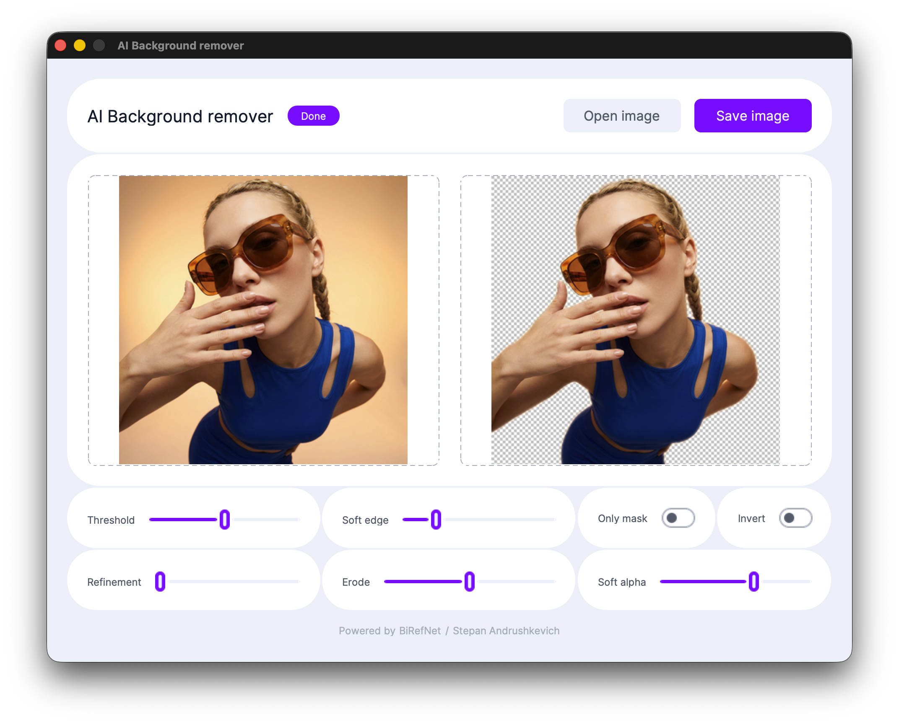

# AI Background Remover

Cross-platform AI app for removing backgrounds from images. Uses **BiRefNet** model — works on macOS and Windows, supports GPU acceleration.



## Features

- **Cross-platform** — macOS and Windows
- **GPU acceleration** — Apple Silicon (MPS), NVIDIA (CUDA), CPU fallback
- **Real-time threshold slider** — fine-tune the cutout boundary (0-255)
- **Transparency preview** — checkerboard background
- **Drag & Drop** — drop image onto the window
- **PNG export** — full alpha channel at original resolution
- **Auto-download model** — BiRefNet downloads once on first launch (~424 MB), then works offline

## Download

Go to [Releases](https://github.com/necrondesign/ai-background-remover/releases) and download:

| Platform | File | Description |
|----------|------|-------------|
| macOS | `AI-Background-Remover-macOS.dmg` | Universal (Apple Silicon MPS + Intel CPU) |
| Windows | `AI-Background-Remover-Windows-CPU.zip` | CPU only, lightweight (~300 MB) |
| Windows | `AI-Background-Remover-Windows-GPU.zip` | NVIDIA CUDA acceleration (~2.5 GB) |

> First launch requires internet to download the AI model (~424 MB). After that the app works fully offline.

## System Requirements

| Component | Minimum | Recommended |
|-----------|---------|-------------|
| OS | macOS 12.0 / Windows 10 | macOS 14.0+ / Windows 11 |
| CPU | Intel Core i5 (2015+) | Apple M1 / modern AMD/Intel |
| RAM | 8 GB | 16 GB |
| Storage | 2 GB free | 5 GB free |

## Usage

1. Launch the app
2. Wait for the model to load (tag shows download progress, then "Ready")
3. Click **Open image** or drag & drop an image
4. Adjust the **Threshold** slider to fine-tune the result
5. Click **Save image** to export as PNG with transparency

### Supported Formats

PNG, JPEG, JPG, WEBP, BMP, TIFF

## Run from Source

```bash
git clone https://github.com/necrondesign/ai-background-remover.git
cd ai-background-remover
python3 -m venv .venv
source .venv/bin/activate   # macOS/Linux
# .venv\Scripts\activate    # Windows
pip install -r requirements.txt
python rmbg_app.py
```

## Build

### Auto-build (GitHub Actions)

Push a tag to trigger builds for both platforms:

```bash
git tag v1.1
git push --tags
```

All 3 builds (macOS DMG, Windows CPU, Windows GPU) will appear in [Releases](https://github.com/necrondesign/ai-background-remover/releases).

### Manual build

**macOS:**
```bash
pip install pyinstaller tkinterdnd2
pyinstaller --noconfirm rmbg_remover.spec
```

**Windows (CPU):**
```cmd
pip install torch torchvision --index-url https://download.pytorch.org/whl/cpu
pip install -r requirements.txt
pip install pyinstaller tkinterdnd2
pyinstaller --noconfirm rmbg_remover.spec
```

**Windows (GPU / CUDA):**
```cmd
pip install torch torchvision --index-url https://download.pytorch.org/whl/cu124
pip install -r requirements.txt
pip install pyinstaller tkinterdnd2
pyinstaller --noconfirm rmbg_remover.spec
```

## Project Structure

```
ai-background-remover/
├── rmbg_app.py              # Main application (UI + business logic)
├── rmbg_remover.spec         # PyInstaller build config
├── requirements.txt          # Python dependencies
├── LICENSE                   # MIT License
├── libs/tkdnd/               # Bundled tkdnd (Drag & Drop, macOS + Windows)
├── textures/                 # Slider textures + app icons
├── scripts/
│   ├── build.sh              # macOS build script
│   ├── build_windows.bat     # Windows build script
│   └── installer.iss         # Inno Setup (Windows installer)
├── tests/
│   └── test_rmbg.py          # Unit tests
└── .github/workflows/
    └── build.yml             # GitHub Actions auto-build
```

## Testing

```bash
python -m pytest tests/ -v
```

## Licensing

- **Application code:** MIT License
- **BiRefNet model:** [Apache 2.0](https://huggingface.co/ZhengPeng7/BiRefNet) (ZhengPeng7)
- **Third-party:** PyTorch (BSD-3), Transformers (Apache 2.0), CustomTkinter (MIT), Pillow (HPND)

## Author

Stepan Andrushkevich — [@necrondesign](https://t.me/necrondesign)
